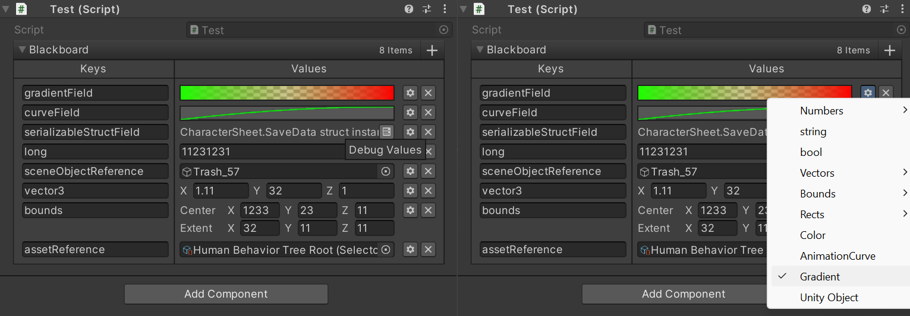

<h2 class="header">Blackboard</h2>

    

        
class in OpenBehaviorTrees

        
/

        
inherits from: <a class="link" href="https://learn.microsoft.com/en-us/dotnet/api/system.collections.generic.dictionary-2?view=net-8.0">Dictionary</a>&lt;string, object>

    

    <a class="link" style="text-align: right" href="mailto:zacharyruiz1@gmail.com" target="_blank">Leave Feedback</a>

<h2 class="small-h2 header">Description</h2>

The Blackboard (sometimes called the data context) is a way for Behavior Trees to have some kind of data store that is global and accessible from all nodes.

The Blackboard implementation in OpenBehaviorTrees uses a dictionary with strings as keys and object as values. Values will need to be cast to an appropriate data type before use when accessing them from nodes.

The Blackboard implementation supports dictionary serialization and can be edited in the inspector. Supported data types are:

 
<ul>
    <li><a class="link" href="https://docs.unity3d.com/ScriptReference/Object.html">UnityEngine.Object</a> (asset references and in scene components/ GameObjects)</li>
    <li>int, double, float, long, string, and bool</li>
    <li>enums of any type</li>
    <li>All <a class="link" href="https://docs.unity3d.com/Manual/VectorCookbook.html">Vector</a> types</li>
    <li> <a class="link" href="https://docs.unity3d.com/ScriptReference/Bounds.html">Bounds</a> and <a class="link" href="https://docs.unity3d.com/ScriptReference/BoundsInt.html">BoundsInt</a></li>
    <li><a class="link" href="https://docs.unity3d.com/ScriptReference/Rect.html">Rect</a> and <a class="link" href="https://docs.unity3d.com/ScriptReference/RectInt.html">RectInt</a></li>
    <li><a class="link" href="https://docs.unity3d.com/ScriptReference/Gradient.html">Gradients</a>, <a class="link" href="https://docs.unity3d.com/ScriptReference/AnimationCurve.html">Animation Curves</a>, and <a class="link" href= "https://docs.unity3d.com/ScriptReference/Color.html">Color</a></li>
    <li>Any struct or class that is serializable using <a class="link" href="https://docs.unity3d.com/ScriptReference/JsonUtility.html">JsonUtility</a> (Although there is no general drawer for it yet.)</li>
</ul>
 
<h2 class="small-h2 header">Example</h2>

You can download the Blackboard from <a class="link" href="https://github.com/Sterberino/UnitySerializedDictionary/">Here</a> to use in your project if you want to use it without OpenBehaviorTrees.

