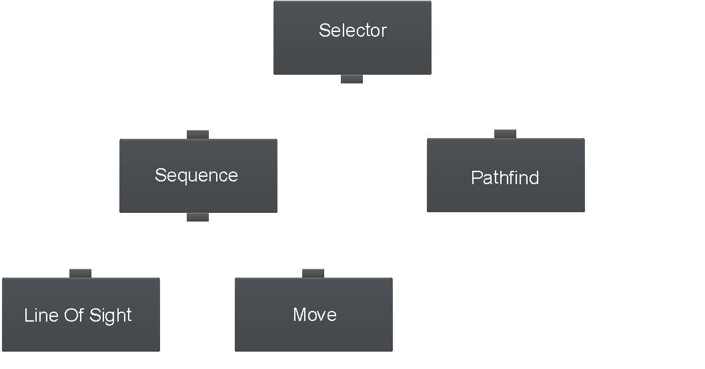

<section class="homepage-section">

    <section class="column">
        <h1 class="landing">Open Behavior Trees</h1>
        
An open-source, flexible Behavior Tree implementation for Unity, inspired by BehaviorDesigner and other Behavior Tree implementations.

        <a class="homepage-button" href="docs/introduction.md">Docs</a>
    </section>
    
</section>

<section class="features-section">
    

        <h2 class="small-h2">Hierarchical Behavior Organization</h2>
        
Behavior trees streamline complex gameplay logic design, ensuring an intuitive gaming experience.

    

        

        <h2 class="small-h2">Dynamic Adaptability</h2>
        
Behavior trees allow for adaptive gameplay, adjusting behaviors based on player actions, enhancing engagement.

    

        

        <h2 class="small-h2">Modular Scalability</h2>
        
The modular design of behavior trees supports effortless scalability, enabling easy addition of features for long-term game success.

    

</section>
